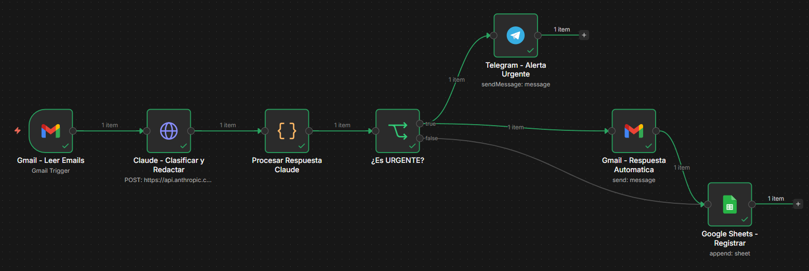
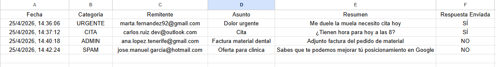
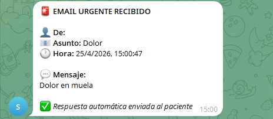

# 📧 Email Classifier AI


> AI-powered email classification system built with N8N and Claude API. Automatically classifies incoming emails, sends real-time Telegram alerts for urgent cases, and replies to patients — all without human intervention.

---

## 🎯 Problem it solves

Clinics receive dozens of emails daily mixed together: patients in pain, appointment requests, supplier invoices, and spam. Someone has to read them all to identify which ones are urgent — and critical emails can go unnoticed for hours.

This system classifies every email in seconds and responds automatically.

---

## ⚙️ How it works

```
Gmail (new unread email)
        ↓
Claude API
  → Classifies into 4 categories
  → Drafts automatic response if needed
        ↓
Is it URGENT?
  ├── YES → Telegram alert + Auto email reply → Google Sheets log
  └── NO  → Auto email reply (if CITA) → Google Sheets log
```

### Classification categories

| Category | Description | Telegram | Auto reply |
|----------|-------------|----------|------------|
| 🚨 URGENT | Pain, emergency, needs attention today | ✅ Yes | ✅ Yes |
| 📅 CITA | Appointment request, service inquiry | ❌ No | ✅ Yes |
| 📋 ADMIN | Supplier, invoice, internal matter | ❌ No | ❌ No |
| 🗑️ SPAM | Advertising, irrelevant | ❌ No | ❌ No |

---

## 🛠️ Tech stack

- **N8N** — Workflow orchestration
- **Claude API (Anthropic)** — Email classification + response drafting
- **Gmail API** — Read incoming emails + send automatic replies
- **Telegram Bot API** — Real-time urgent alerts
- **Google Sheets** — Email log and traceability

---

## 📸 Screenshots

### Workflow in N8N


### Google Sheets log — 4 categories classified correctly


### Telegram alert for urgent email


### Automatic email reply sent to patient


---

## 🚀 Setup

### Prerequisites
- N8N (cloud or self-hosted)
- Gmail account with OAuth2 configured in N8N
- Anthropic API Key
- Telegram bot created via @BotFather
- Google Sheets with columns: `Fecha | Categoria | Remitente | Asunto | Resumen | Respuesta Enviada`

### Steps

**1. Import the workflow**
- N8N → top right menu → Import from file
- Select `workflow/email_classifier_v2.json`

**2. Configure credentials**

| Node | Credential | How to get it |
|------|-----------|---------------|
| Gmail Trigger + Send | Gmail OAuth2 | N8N → Credentials → New → Gmail OAuth2 |
| Claude API | HTTP Header Auth | Header: `x-api-key` / Value: your key from console.anthropic.com |
| Telegram | Telegram API | Token from @BotFather → Chat ID from @userinfobot |
| Google Sheets | Google Sheets OAuth2 | N8N → Credentials → New → Google Sheets |

**3. Configure Google Sheets**
- Create a new spreadsheet
- Name the tab `Emails`
- Add headers in row 1: `Fecha | Categoria | Remitente | Asunto | Resumen | Respuesta Enviada`
- Copy the Sheet ID from the URL (the long string between `/d/` and `/edit`)

**4. Activate and test**
- Send a test email to the connected Gmail account: *"I've had terrible tooth pain for 3 days, I need an urgent appointment"*
- Run the workflow manually from N8N
- Verify the Telegram alert arrives and the auto-reply is sent
- If everything works, activate the automatic trigger

---

## 📊 Results

After testing with 4 different email types:

| Date | Category | Sender | Subject | Reply Sent |
|------|----------|--------|---------|------------|
| 25/4/2026, 14:36 | URGENT | marta.fernandez92@gmail.com | Dolor urgente | SÍ |
| 25/4/2026, 14:37 | CITA | carlos.ruiz.dev@outlook.com | Cita | SÍ |
| 25/4/2026, 14:40 | ADMIN | ana.lopez.tenerife@gmail.com | Factura material dental | NO |
| 25/4/2026, 14:42 | SPAM | jose.manuel.garcia@hotmail.com | Oferta para clinica | NO |

**Accuracy: 4/4 correct classifications ✅**

---

## 🔧 Customization

Change the prompt in the Claude node to adapt this to any business:
- **Real estate agencies** — leads, inquiries, property owners, visits
- **Accounting firms** — tax urgencies, clients, documentation
- **E-commerce** — complaints, orders, returns, inquiries

---

## 👤 Author

**Aday** — Automation Developer  
Stack: N8N · Claude API · Python · Google Sheets · Supabase  
[LinkedIn](#) · [Portfolio](https://github.com/adayautomation)
